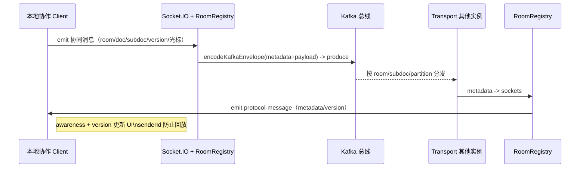
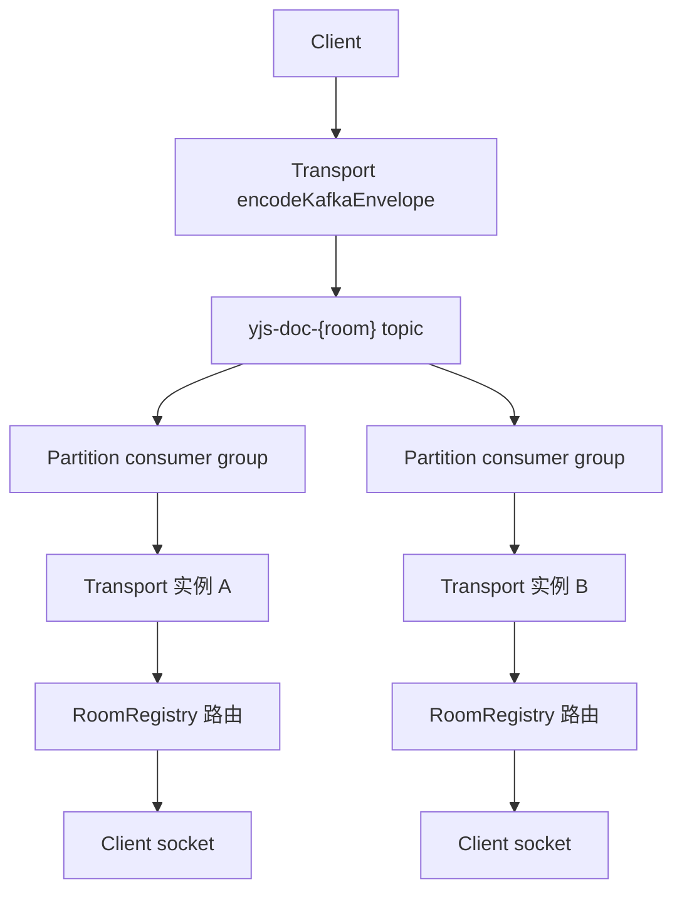
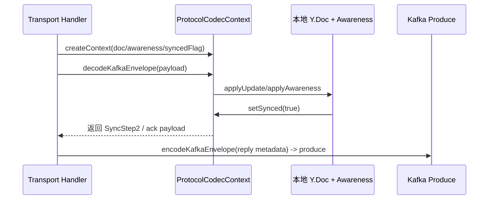
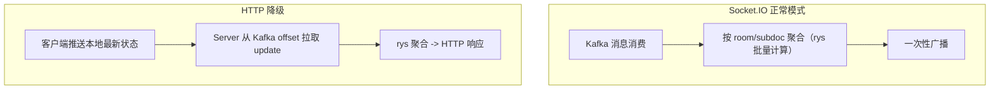
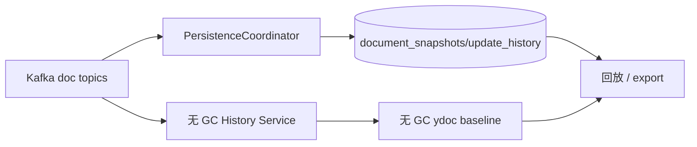
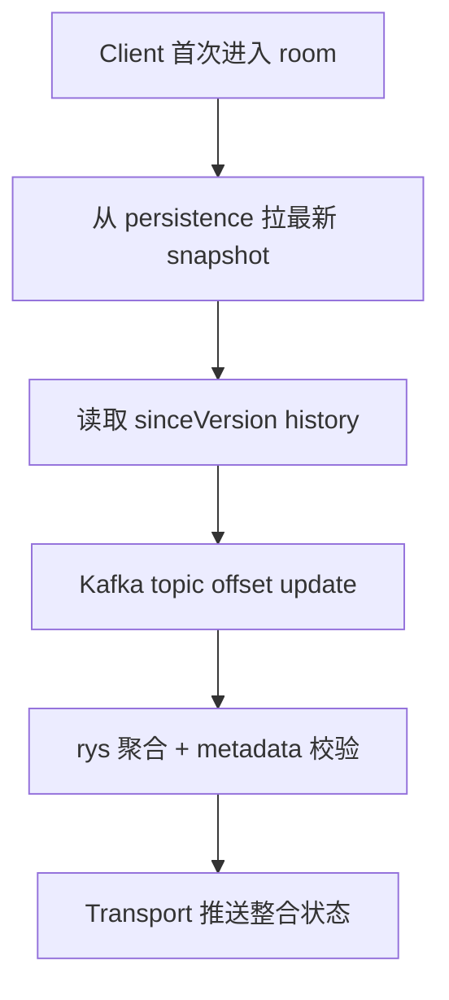

# 基于Kafka的协作服务器架构

本项目以 Kafka 为**唯一总线**，为 Yjs/Socket.IO 协作场景提供**无状态的同步传递、可聚合的下发、全链条可回放**能力。以下 README 替代了原来的 `docs/ARCHITECTURE.md`，全面展示 architecture 流程图、package 职责、降级策略与 developer checklist。`docs/ARCHITECTURE.md` 现仅保留具体实现细节（下文参考），若需要强对齐代码的指导再去查阅。

## 1. Architecture Overview

| 包 | 作用 | 核心能力 / 参考文件 |
| --- | --- | --- |
| `transport` | 承接 Socket.IO 客户端连接，在 metadata 无状态下进行 Kafka `produce` 与 `consume` | 参看 `packages/transport/README.md` 与 `src/socketHandlers.ts`、`src/kafkaConsumer.ts`，`RoomRegistry` 路由、`createBusSocketHandlers` metadata 补全。 |
| `protocol` | 复刻 y-websocket 协议：同步、awareness、control 封装成 Kafka envelope | 见 `protocolMessageCodec`（metadata fields）、`handlers/*` 的 `syncProtocol`/`awarenessProtocol` 逻辑，确保 `ProtocolCodecContext` 与 `encodeKafkaEnvelope`/`decodeKafkaEnvelope` 兼容 `@y/protocols`。 |
| `persistence` | 将 Kafka doc update 落盘（快照 + update history）、提供 recover/export 接口 | `PersistenceCoordinator` + `PersistenceAdapter` 写入 `document_snapshots`/`update_history`，历史 service 维护无 GC ydoc baseline，使用 `TypeOrmPersistenceAdapter`（可替换 adapter）。 |

## 2. Kafka + Socket.IO 主流程

所有协同交互始终依赖 Kafka 总线：

1. 客户端通过 Socket.IO/HTTP 发送 update/awareness，携带 `roomId/docId/subdocId/version/senderId` 等 metadata。
2. transport handler 通过 `protocolCodec.encodeKafkaEnvelope` 将 metadata 与 payload 发送到 Kafka topic（`yjs-doc-{room}`/`yjs-awareness-{room}`）。
3. 所有 transport 实例都订阅 topic，consumer group 协调 partition，每条消息被 `protocolCodec.decodeKafkaEnvelope` 解码后，根据 metadata 在 `RoomRegistry` 中精确查找 sockets，并把 update/awareness 广播回 clients。
4. 客户端根据 `senderId` 跳过自回放，用 `version` 更新本地状态；service 端利用 metadata 判断是否需要 persistence/聚合。

### 主流程：Socket.IO ⇄ Kafka ⇄ Socket.IO



### Kafka Partition 路由与 consumer group



metadata（`roomId/docId/subdocId`）决定 topic & partition，consumer group 在多个实例间分配 partition，实例内部的 `RoomRegistry` 查找 socket 以避免跨 room 广播。

### ProtocolCodecContext & yjs lifecycle



`ProtocolCodecContext` 利用 `syncProtocol`/`awarenessProtocol` 在接受 Kafka update 后更新 `Y.Doc`，必要时生成 SyncStep2 回推 Kafka 继续同步；`metadata` 保持 `roomId` 优先、`version` 用于 persistence ordering、`senderId` 用于去重。

## 3. 聚合 & 降级策略



聚合阶段通过 `rys` 将多条 awareness/update 合并后再 broadcast，减少重复渲染；在 HTTP 降级或 long poll 场景，客户端主动上传本地最新状态，服务端再从 Kafka offset 里拉取更新、聚合后统一返回，保持一致性。

### HTTP API 支持 (阅读态/降级)

Server 端提供了纯 HTTP 接口，用于不支持 WebSocket 的环境（如纯阅读态、防火墙限制）或作为连接失败的降级方案：

* **获取文档状态 (阅读态)**: `GET /collab/doc/:docId`
  * 返回 `{ docId, snapshot, updates }`。
  * 客户端可利用 snapshot (Base64) 初始化 Y.Doc，并应用 updates (Base64 数组) 追平最新状态。
* **发布更新 (降级写)**: `POST /collab/publish`
  * 接受 `{ roomId, docId, content }`。
  * 将 Yjs update 直接推送到 Kafka，后续流程与 WebSocket 一致。

## 4. 持久化与历史服务（只有 doc update）



Persistence service 依据 metadata + `version` 写入 `document_snapshots` 与 `update_history`（仅 doc update），提供 `recoverSnapshot` 和 `exportHistory`；无 GC History service 订阅 Kafka，保留 snapshot 之间的 baseline 供历史回放。awareness 不写入持久化，只在 Kafka/clients 之间传播。

### 4.1 对象存储配置（S3/MinIO/OSS/本地）

* `apps/server/config/server.config.yaml` 新增 `storage` 节点：

  ```yaml
  storage:
    driver: local   # default，可替换为 minio/s3/oss 或自定义字符串
    basePath: dist/data
  ```

  默认 `driver=local` 时，`ServerCollabService` 会使用 `LocalObjectStorageClient` 将快照写入 `dist/data`，并把返回的 `storageLocation` 记录在数据库里。

* 服务器在 `ServerCollabModule` 中注册 `OBJECT_STORAGE_CLIENT`。如果需要 MinIO/S3/阿里云 OSS，只需提供自定义的 `ObjectStorageClient` 实现以及对应的 `driver` 配置即可。实现需覆盖 `putObject/getObject`，其余流程保持不变。

* 恢复时若数据库里没有快照二进制但保存了 `storageLocation`，服务会自动从对象存储回填，保证长期归档的数据可被读回。

### 首次进入 room 的强同步



系统先用 persistence snapshot 提供基线，再补上 `sinceVersion` history 与 Kafka offset update；聚合后回推 transport，确保 doc/awareness/version 一致。

## 5. Kafka 分区能力展示与配置

| 项目 | 说明 |
| --- | --- |
| 主题命名 | 服务端遵循 `topicFor(docId)`（目前输出 `sync-${roomId}`）；生产环境可通过 `topicResolver.resolveSyncTopic` 组合 `roomId`/`tenantId`/`docId` 生成 `yjs-sync-${tenant}-${room}` 等分区层级。 |
| 分区策略 | Producer 使用 `Partitioners.LegacyPartitioner`（依据消息 key 的 hash 决定 partition），因此只需在 Kafka 端为 `sync-*` 主题创建多于 1 个 partition 即可让同一 doc 的消息按 partition 均匀分布；consumer group 每个实例消费分配的 partition。 |
| topic 创建示例 | ```bash<br>bin/kafka-topics.sh --create --topic sync-room-42 --partitions 6 \ --replication-factor 1 --bootstrap-server localhost:9092``` |
| consumer group | `ServerCollabService` 可通过配置文件指定 consumer group（默认为 `collab-server-sync`），Kafka 会将 partition 分配给不同 consumer 实例，同时确保 `GroupInstanceId` 若设置可保留分区。 |
| 验证分片 | ```bash<br>bin/kafka-topics.sh --describe --topic sync-room-42 --bootstrap-server localhost:9092``` 观察 partition 数量和 leader/distribution；verify consumer groups with `kafka-consumer-groups.sh --describe --group collab-server-sync`。 |
| 进阶 | 可在 `ServerCollabService.topicFor` 中引入 `roomId` hash 逻辑，把 doc 映射到多个 topic；也可自定义 `Partitioners.LegacyPartitioner` 替代函数以锁定 awareness/update 到特定 partition。 |

## 6. 开发者入门 & 调试清单

### 环境准备

1. `pnpm install`
2. 配置 Kafka topic（`yjs-sync-{room}`、`yjs-awareness-{room}`、可选 `yjs-control-{room}`）并在 YAML 配置里填入 brokers、consumerGroup 等参数。
3. 数据库（`DATA_SOURCE_URL`）；`persistence` 默认用 TypeORM+MySQL，表 `document_snapshots`、`update_history`、`awareness` 不持久化。

### 启动服务

1. `pnpm --filter @y-kafka-collabation-server/transport dev`：inject `roomRegistry`、`protocolCodec`、`kafkaProducer/Consumer`，`createBusSocketHandlers` 处理 connection/message/disconnect。
2. `pnpm --filter @y-kafka-collabation-server/persistence dev`：`PersistenceCoordinator` 写 `document_snapshots.version` 与 Kafka metadata 中 version 保持一致，`historyOnly` 控制 snapshot 频率。
3. `pnpm --filter @y-kafka-collabation-server/server dev`: 启动演示用的 API Server (NestJS)，提供 Kafka/DB 状态查询与 HTTP 降级接口。**启动后访问 <http://localhost:3000/api> 查看 Swagger 文档**。
4. Protocol library 通过 `ProtocolCodecContext`、`decodeMessage`、`encodeSyncStep1` 被 transport/HTTP handler 调用，确保 Y.Doc 与 awareness 更新一致。

### Metadata & version 约定

| 字段 | 含义 | 用法 |
| --- | --- | --- |
| `roomId` | 文档类型/聚合粒度 | 用于 Kafka topic（`docs-{roomId}`），默认为 `default` |
| `docId` | 具体 Y.Doc | 一 room 可多 doc；consumer 以上数据构建 local state |
| `subdocId` | 子文档分片 | RoomRegistry routing + persistence query |
| `version` | 当前版本 | persistence ordering + history sinceVersion |
| `senderId` | 客户端唯一标识 | consumer skip 自己的消息，awareness diff |
| `timestamp` | 事件时间 | logs/metrics + HTTP check |

### 常见排查

* 无同步：确认 Kafka topic 有消息、consumer 在拉、RoomRegistry 有 connections。
* Metadata mismatch：在 transport handler/consumer log 中打印 metadata；topic pattern/vdoc/subdoc 是否一致。
* Persistence restore：`recoverSnapshot` + `exportHistory` 需返回 delta，`update_history` 应含 version。
* HTTP 降级：通过 `kafkajs` consumer `getOffsets` 拉出 chunk，再用 `rys` 聚合 -> `protocol-message` 返回。

### 推荐拓展

1. 自定义 `RoomRegistry`，利用 Redis pub/sub 实现跨进程 socket 状态同步，参考 `transport/src/roomRegistry.ts`。
2. 利用 `topicResolver` 生成多租户 topic（`yjs-doc-${tenantId}-${roomId}`）。
3. 补充 `yjs-control` channel 实现 snapshot/revalidate 命令。

## 7. 参考资源

* [y-websocket (Yjs 官方)](https://github.com/yjs/y-websocket)
* [@y/protocols](https://github.com/yjs/y-protocols)
* [lib0 encoding](https://github.com/yjs/lib0)
* [Kafka consumer group design](https://kafka.apache.org/documentation/#consumerconfigs_group.instance.id)
* [rys (批处理/聚合库)](https://github.com/equalsraf/rys)

如需更深入的代码指引（`src/socketHandlers.ts`、`src/protocolMessageCodec.ts`、`src/coordinator.ts` 等），请参阅 `docs/ARCHITECTURE.md` 实现细节章节。
