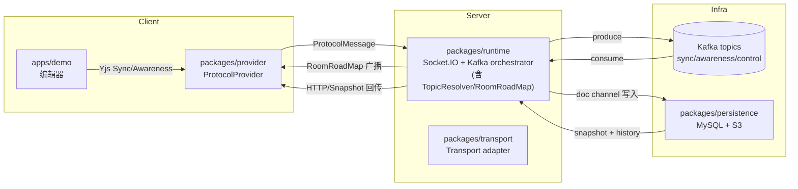
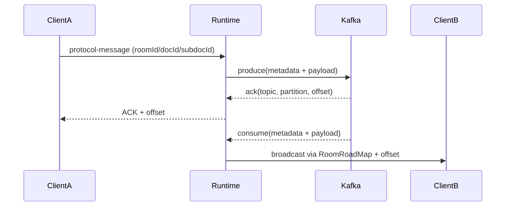
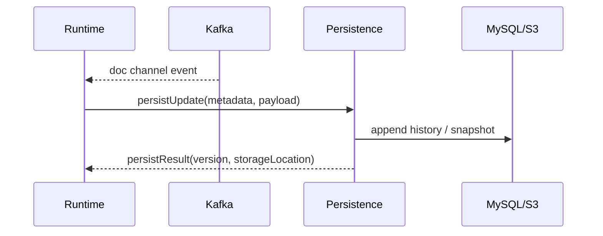
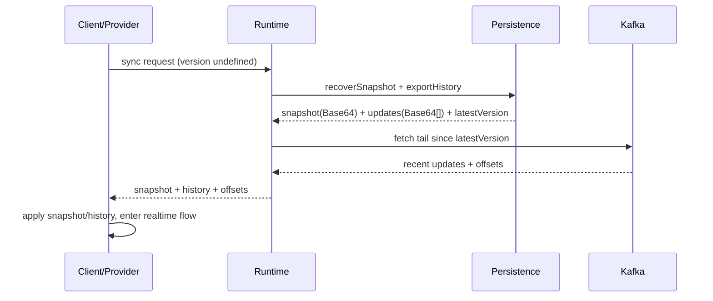
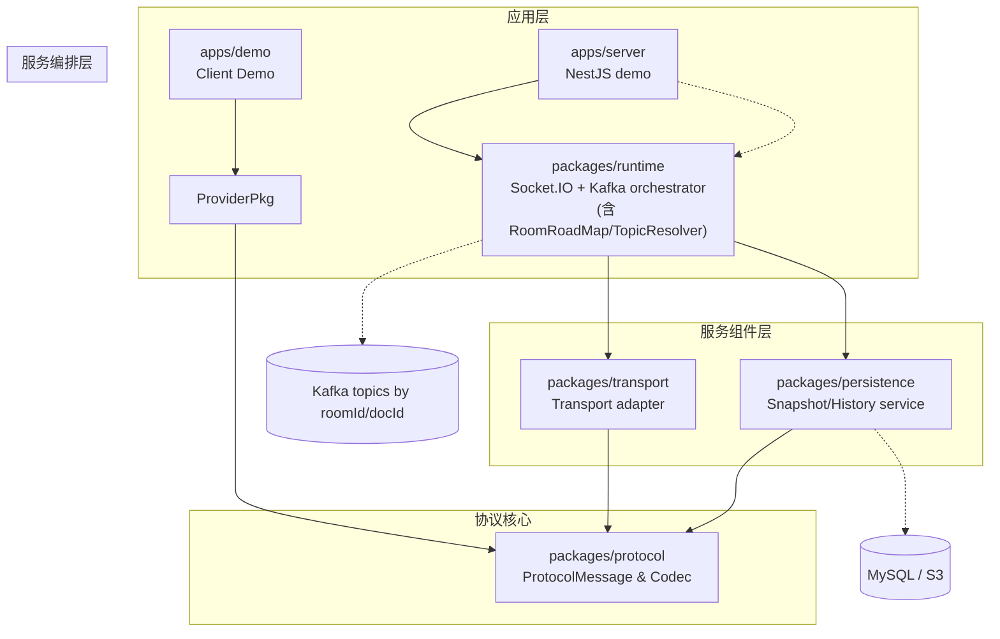

# 基于 Kafka 的协作数据模型

## 1. 端到端概览

- **上行链路（Client → Server → Kafka）**：Provider 直接生成 `[metadataLength][metadata JSON][payload]` envelope，Runtime 只校验 metadata（room/doc/channel 等）并调用 Kafka producer。写入成功后将 `(topic, partition, offset)` ACK 给发起客户端，客户端把 offset 当作最新 version。
- **下行链路（Server ← Kafka）**：Runtime 订阅 `sync/awareness` topic，得到 envelope 后解 metadata + payload，并根据 `RoomRoadMap` 将原始 yjs payload 转发给当前服务器上的相关连接，保持状态一致。
- **Kafka → Persistence / Runtime ↔ Persistence**：  
  - 写入：Persistence 订阅 `sync-{room}`，将 doc channel 增量落 MySQL/S3，并维护 snapshot/history。Runtime 不再额外回写持久层。  
  - 回读：客户端初始化 version 缺省时，由 Runtime 向 Persistence 请求 snapshot + history，再把最新 offset（或 Kafka tail）一并返给客户端，使其衔接实时链路。

## 2. 角色与职责

| 包 | 角色 | 重点能力 |
| --- | --- | --- |
| `packages/provider` | 客户端 Provider | 管理 `Y.Doc` & Awareness，暴露 Socket.IO/WebsocketProvider 风格 API。 |
| `apps/demo` | 演示客户端 | 集成 Provider，展示文档/白板等协同场景。 |
| `packages/runtime` | 服务端 Runtime（核心 orchestrator） | 内建 Socket.IO server，串接 protocol、Kafka、TopicResolver、RoomRoadMap、Persistence hooks。 |
| `packages/transport` | 传输适配层 | 提供 `createSocketMessageTransportHandlers`、`startKafkaConsumer`，供 runtime 注入或复用。 |
| `packages/protocol` | 协议核心 | 统一 `ProtocolMessage` metadata、Yjs 编解码、Kafka envelope。 |
| `packages/persistence` | 持久化服务 | Snapshot/history、对象存储挂载，对 runtime/server 暴露恢复 API。 |
| `apps/server` | NestJS Demo | 将 runtime 打包成 Nest 模块，附带 HTTP Snapshot/Publish 等调试接口。 |

## 3. 数据流细化

1. **客户端 → Runtime**  
   - Provider/Transport 直接调用 `protocol.encodeKafkaEnvelope(metadata, payload)`，在发送前就把 `roomId/docId/subdocId/senderId/channel/version` 等 metadata 填好。  
   - Runtime 只负责校验 metadata 与连接是否匹配，并根据 `RoomRoadMap`/鉴权策略决定是否接受。
2. **Runtime → Kafka**  
   - Runtime 将收到的 envelope 原样写入 Kafka，TopicResolver 通过 metadata 选定 topic，Kafka key 固定为 `docId` 以保持 partition 内顺序。  
   - Kafka ACK 后，Runtime 把 `(topic, partition, offset)` 返回给发起客户端，客户端据此更新 version。
3. **Kafka → Runtime → 客户端**  
   - Runtime 的 Kafka consumer 解 envelope，取出 metadata 与原始 yjs payload。  
   - 通过 `RoomRoadMap(roomId, docId, subdocId)` 找到本机需要广播的 Socket/HTTP 连接，直接下发 yjs payload（客户端可无缝复用 yjs handler）。  
   - 如有需要，Runtime 可把 offset/metadata 附带给广播对象，用于侧写日志或状态同步。
4. **Kafka → Persistence**  
   - Persistence 订阅 `channel === 'doc'` 的 topic，按 metadata 维度写入增量、刷新 snapshot，并将大体积快照同步到对象存储（S3 等）。  
   - Persistence 维护“已覆盖到的 offset”，面对 Kafka retention 也能通过 snapshot + history 恢复。
5. **Runtime ↔ Persistence（客户端初始化）**  
   - 当客户端以 `version` 缺省发起同步时，Runtime 调用 `recoverSnapshot` + `exportHistory` 获取最近快照、缺失增量以及最新 offset。  
   - Runtime 将 snapshot/history/offset 返回给客户端（或直接帮忙写入 Kafka），客户端应用后即可接入实时消费；若环境允许，也可以让客户端直接访问 Persistence API。

## 4. 基础概念与运行时设施

- **Topic 分类（默认命名）**  
  - `sync-{roomId}`：文档增量，唯一会写入 Persistence。  
  - `awareness-{roomId}`：短生命周期状态。  
  - `control-{roomId}`：控制命令，可扩展，例如强制同步、版本校验。
- **关键字段**  
  - `roomId`：协作房间/租户标识，与 topic 强绑定。  
  - `docId`：单个文档或聚合文档 ID，用于 Kafka key。  
  - `subdocId?`：可选子文档 ID，支持分片广播。  
  - `channel`：`'doc' | 'awareness' | 'control'`。  
  - `payload`：`Uint8Array`（Yjs SyncStep/Awareness diff/控制消息）。
- **ProtocolMessage**：唯一的事件载体，包含 `roomId/docId/subdocId/channel/version/senderId/timestamp/payload`，所有组件以此为契约。
- **运行时设施**  
  - `RoomRoadMap`：Runtime 暴露的可插拔接口，记录 `(roomId, docId, subdocId) → sockets/HTTP` 映射，用于将 Kafka 消费结果映射到当前服务器连接；默认是内存 Map，可自行实现 Redis/多实例版本并注入 runtime。  
  - `TopicResolver`：一个可传入的（async）函数/接口，输入 `metadata`，输出标准 topic 字符串。Runtime 默认实现只是字符串拼接；如需多租户、哈希分片或跨集群路由，可替换该函数，无需修改其他包。

### 版本与分片策略

1. **默认方案：version = Kafka offset**  
   - `docId` 作为 Kafka key，所有消息落在固定 partition。  
   - Runtime 写入成功后拿到 `(topic, partition, offset)`，立即经 Socket.IO ACK 给发起客户端；客户端记录最新 offset 作为 version。  
   - Persistence 在 snapshot/update_history 中记录“覆盖到的 offset”，应对 Kafka retention。
2. **扩容方案：虚拟槽位 / 一致性哈希**  
   - `docId` 先映射到 slot（如 1024 个虚拟节点），slot 再映射到物理 partition。  
   - TopicResolver 在生成 topic 时附带 slot 版本，扩容时只需迁移少量 slot。  
   - 客户端 version 仍等价于 offset，不感知 slot 迁移。
3. **回退方案：逻辑自增 version**  
   - 若必须用全局自增序列（例如数据库强一致），可以在 Persistence 或 runtime 层生成自增 version，再写入 Kafka。  
   - 需要额外维护 `version → payload` 的映射，牺牲部分无状态特性，但扩容最灵活。

## 5. 典型时序

### 5.1 实时往返（含 ACK / 第三方广播）

### 5.2 持久化写入

### 5.3 初始化恢复（version 缺省）

> 下行广播的两个步骤可直接参考 5.1：Runtime 在 ACK 阶段将 `(topic, partition, offset)` 返回发起方，在第三方广播阶段携带最新 offset 推送给 RoomRoadMap 中的其他连接。

## 6. 包架构与依赖层级

> Protocol 是所有包的共同契约；Runtime 组合 Transport + Persistence + RoomRoadMap/TopicResolver，并对接 Kafka/对象存储；apps/server 只是将 runtime 嵌入 NestJS；apps/demo 仅依赖 Provider，经 Socket.IO 直连 Runtime。

## 7. 调试与扩展提示

1. **上行链路**：确保 Provider 补齐 `roomId/docId/subdocId/channel`，Runtime 日志应打印 metadata，便于追踪。  
2. **Kafka 消费**：关注 consumer lag、TopicResolver 输出；若 ack 版本与客户端不一致，优先检查 partition key 是否固定为 `docId`。  
3. **RoomRoadMap 健康**：Runtime 在 connect/disconnect 时应正确登记/清理映射；如需分布式广播，可实现 Redis 版本并注入。  
4. **Persistence 恢复**：`recoverSnapshot + exportHistory` 返回的 version/offset 要与客户端上报的 lastVersion 对齐，否则需要回退到 snapshot 全量恢复。  
5. **HTTP 降级**：Runtime 可复用 Socket.IO 的 Engine.IO 降级；若完全走 HTTP fallback，可直接调用 Persistence/Runtime 暴露的 Snapshot/Publish 接口。  
6. **扩展点**：TopicResolver（多租户/哈希）、RoomRoadMap（Redis/多实例）、对象存储适配、Authorization Hook、控制面命令（`control-{roomId}`）等均可通过 Fork + 注入自定义实现完成。

---
