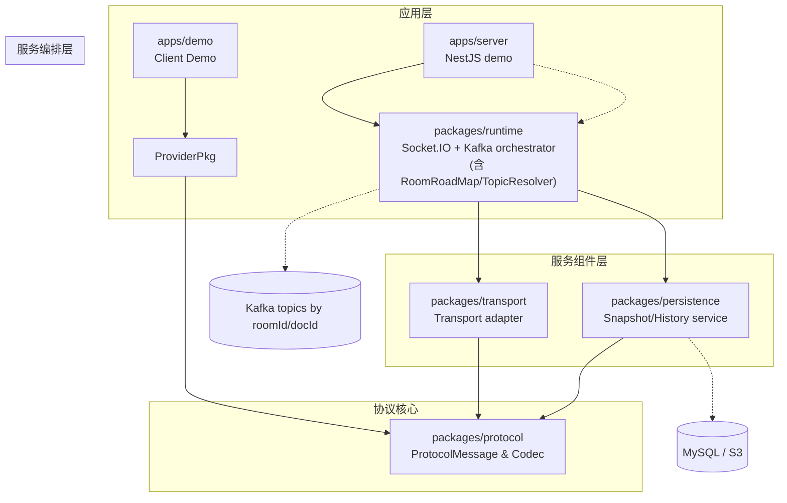

# 基于 Kafka 的协作数据模型

## 1. 端到端概览

```mermaid
flowchart LR
    subgraph Client
        Provider[packages/provider\nProtocolProvider]
        Demo[apps/demo\n编辑器]
    end

    subgraph Server
        Runtime[packages/runtime\nSocket.IO + Kafka orchestrator\n(含 TopicResolver/RoomRoadMap)]
        Transport[packages/transport\nTransport adapter]
    end

    subgraph Infra
        Kafka[(Kafka topics\nsync/awareness/control)]
        Persistence[packages/persistence\nMySQL + S3]
    end

    Demo -->|Yjs Sync/Awareness| Provider
    Provider -->|ProtocolMessage| Runtime
    Runtime -->|produce| Kafka
    Kafka -->|consume| Runtime
    Runtime -->|RoomRoadMap 广播| Provider
    Runtime -->|doc channel 写入| Persistence
    Persistence -->|snapshot + history| Runtime
    Runtime -->|HTTP/Snapshot 回传| Provider
```

- **上行链路（Client → Server → Kafka）**：客户端生成 doc/awareness buffer，经 Runtime 编解码后写入 Kafka；写入成功即返回 `(topic, partition, offset)` 给发起客户端作为最新 version。
- **下行链路（Server ← Kafka）**：Runtime 订阅 `sync/awareness` topic，消费后根据 `RoomRoadMap` 将消息广播给当前服务器上所有相关连接，保证 Yjs 状态一致。
- **服务器 ↔ Persistence**：  
  - 写入：Runtime 订阅 `sync` 消息，定期把增量合并为 Yjs 基线（含无 GC 的完整 `Y.Doc`），写入 MySQL，并将大快照同步到 S3。  
  - 回读：客户端初始化时默认不带 version，Runtime 调用 Persistence 获取最近的 snapshot + history，再结合 Kafka tail 让客户端恢复最新状态。

## 2. 角色与职责

| 包 | 角色 | 重点能力 |
| --- | --- | --- |
| `packages/provider` | 客户端 Provider | 管理 `Y.Doc` & Awareness，暴露 Socket.IO/WebsocketProvider 风格 API。 |
| `apps/demo` | 演示客户端 | 集成 Provider，展示文档/白板等协同场景。 |
| `packages/runtime` | 服务端 Runtime（核心 orchestrator） | 内建 Socket.IO server，串接 protocol、Kafka、TopicResolver、RoomRoadMap、Persistence hooks。 |
| `packages/transport` | 传输适配层 | 提供 `createBusSocketHandlers`、`startKafkaConsumer`，供 runtime 注入或复用。 |
| `packages/protocol` | 协议核心 | 统一 `ProtocolMessage` metadata、Yjs 编解码、Kafka envelope。 |
| `packages/persistence` | 持久化服务 | Snapshot/history、对象存储挂载，对 runtime/server 暴露恢复 API。 |
| `apps/server` | NestJS Demo | 将 runtime 打包成 Nest 模块，附带 HTTP Snapshot/Publish 等调试接口。 |

## 3. 数据流细化

1. **客户端 → 服务器**  
   - Provider 发送 doc/awareness buffer。  
   - Runtime 在握手阶段补 `roomId/docId/senderId/channel` 等 metadata。
2. **服务器 → Kafka**  
   - 调用 `protocol.encodeKafkaEnvelope(metadata, payload)`，并通过 TopicResolver 得到目标 topic。  
   - Kafka key 固定为 `docId`，保证 partition 内顺序。
3. **Kafka → 服务器**  
   - Runtime 消费 `sync/awareness` topic，解析出 metadata。  
   - 通过 `RoomRoadMap(roomId, docId, subdocId)` 查询本机需要广播的 Socket/HTTP 连接，再推送协议事件。
4. **服务器 → Persistence**  
   - `channel === 'doc'` 的消息写入 `PersistenceCoordinator`：存增量、刷新 snapshot，超大 payload 上传 S3。
5. **服务器 ← Persistence（客户端初始化）**  
   - 客户端以 `version` 缺省（或 `undefined`）发起同步。  
   - Runtime 请求 `recoverSnapshot` + `exportHistory`，返回 Base64 snapshot + updates，并告知补齐的 Kafka offset。  
   - 客户端应用后进入实时链路，继续消耗 Kafka tail。

## 4. 基础概念与运行时设施

- **Topic 分类（默认命名）**  
  - `sync-{roomId}`：文档增量，唯一会写入 Persistence。  
  - `awareness-{roomId}`：短生命周期状态。  
  - `control-{roomId}`：控制命令，可扩展，例如强制同步、版本校验。
- **关键字段**  
  - `roomId`：协作房间/租户标识，与 topic 强绑定。  
  - `docId`：单个文档或聚合文档 ID，用于 Kafka key。  
  - `subdocId?`：可选子文档 ID，支持分片广播。  
  - `channel`：`'doc' | 'awareness' | 'control'`。  
  - `payload`：`Uint8Array`（Yjs SyncStep/Awareness diff/控制消息）。
- **ProtocolMessage**：唯一的事件载体，包含 `roomId/docId/subdocId/channel/version/senderId/timestamp/payload`，所有组件以此为契约。
- **运行时设施**  
  - `RoomRoadMap`：Runtime 暴露的可插拔接口，记录 `(roomId, docId, subdocId) → sockets/HTTP` 映射，用于将 Kafka 消费结果映射到当前服务器连接；默认是内存 Map，可自行实现 Redis/多实例版本并注入 runtime。  
  - `TopicResolver`：一个可传入的（async）函数/接口，输入 `metadata`，输出标准 topic 字符串。Runtime 默认实现只是字符串拼接；如需多租户、哈希分片或跨集群路由，可替换该函数，无需修改其他包。

### 版本与分片策略

1. **默认方案：version = Kafka offset**  
   - `docId` 作为 Kafka key，所有消息落在固定 partition。  
   - Runtime 写入成功后拿到 `(topic, partition, offset)`，立即经 Socket.IO ACK 给发起客户端；客户端记录最新 offset 作为 version。  
   - Persistence 在 snapshot/update_history 中记录“覆盖到的 offset”，应对 Kafka retention。
2. **扩容方案：虚拟槽位 / 一致性哈希**  
   - `docId` 先映射到 slot（如 1024 个虚拟节点），slot 再映射到物理 partition。  
   - TopicResolver 在生成 topic 时附带 slot 版本，扩容时只需迁移少量 slot。  
   - 客户端 version 仍等价于 offset，不感知 slot 迁移。
3. **回退方案：逻辑自增 version**  
   - 若必须用全局自增序列（例如数据库强一致），可以在 Persistence 或 runtime 层生成自增 version，再写入 Kafka。  
   - 需要额外维护 `version → payload` 的映射，牺牲部分无状态特性，但扩容最灵活。

## 5. 典型时序

- **实时往返**：Client → Runtime → Kafka → Runtime → Client。  
- **持久化写入**：Runtime 消费 doc channel → Persistence（MySQL/S3）。  
- **初始化恢复**：Client 连接（version 缺省）→ Runtime 拉取 Persistence snapshot/history + Kafka offset → 返回给 Client → Client 应用后继续监听实时流。  
- **下行广播（offset 更新）**：  
  1. **ACK 链路**：客户端上行 update 后，Runtime 写入 Kafka，拿到 `(topic, partition, offset)` 并立即 ACK；客户端据此刷新本地 version/offset。  
  2. **第三方广播**：其他客户端的 update 回到 Runtime 时，Runtime 将 payload + 最新 offset 广播给所有活跃连接；每个客户端应用 update 后同步更新本地 offset。

> TODO：按上述场景补充 Mermaid sequenceDiagram（实时往返 / 持久化写入 / 初始化恢复）。

## 6. 包架构与依赖层级



> Protocol 是所有包的共同契约；Runtime 组合 Transport + Persistence + RoomRoadMap/TopicResolver，并对接 Kafka/对象存储；apps/server 只是将 runtime 嵌入 NestJS；apps/demo 仅依赖 Provider，经 Socket.IO 直连 Runtime。

## 7. 调试与扩展提示

1. **上行链路**：确保 Provider 补齐 `roomId/docId/subdocId/channel`，Runtime 日志应打印 metadata，便于追踪。  
2. **Kafka 消费**：关注 consumer lag、TopicResolver 输出；若 ack 版本与客户端不一致，优先检查 partition key 是否固定为 `docId`。  
3. **RoomRoadMap 健康**：Runtime 在 connect/disconnect 时应正确登记/清理映射；如需分布式广播，可实现 Redis 版本并注入。  
4. **Persistence 恢复**：`recoverSnapshot + exportHistory` 返回的 version/offset 要与客户端上报的 lastVersion 对齐，否则需要回退到 snapshot 全量恢复。  
5. **HTTP 降级**：Runtime 可复用 Socket.IO 的 Engine.IO 降级；若完全走 HTTP fallback，可直接调用 Persistence/Runtime 暴露的 Snapshot/Publish 接口。  
6. **扩展点**：TopicResolver（多租户/哈希）、RoomRoadMap（Redis/多实例）、对象存储适配、Authorization Hook、控制面命令（`control-{roomId}`）等均可通过 Fork + 注入自定义实现完成。

---
