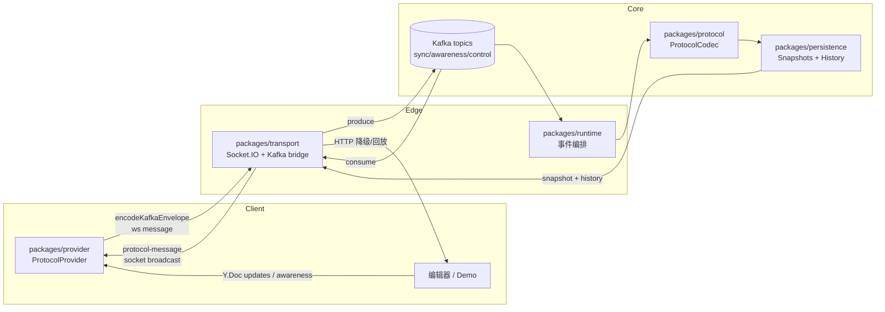
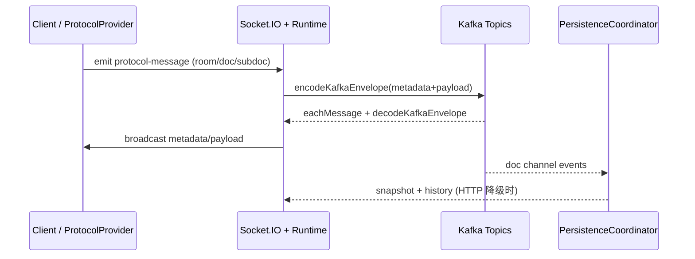

# 基于 Kafka 的协作数据模型

本 README 汇总了当前仓库的包划分、历史 README 中的流程图以及最新的数据流设计，帮助理解「客户端 → Kafka → 持久化/广播」的端到端通路。详细代码示例可在各 package README 中查看。

## 1. 总览：跨包数据流向图



* **Provider**：封装 `Y.Doc` 与 `ProtocolCodecContext`，对前端暴露与 y-websocket 一致的事件。
* **Transport**：Socket.IO 服务器，将客户端消息变成 Kafka envelope，并在消费后根据 metadata 路由给 sockets。
* **Runtime**：作为 protocol 与 transport 之间的胶水层，负责把 Socket.IO 事件编排到 Kafka/Protocol 流程。
* **Protocol**：统一编解码（`encodeKafkaEnvelope`、`decodeMessage`）并生成 `SyncStep`、Awareness payload。
* **Persistence**：把 doc channel 的事件写入 snapshot/history，供冷启动和 HTTP 降级回放。

## 2. Package 速查

| 包 | 角色 | 重点能力 |
| --- | --- | --- |
| `packages/protocol` | 协议层 | Yjs 消息编解码、Kafka envelope、metadata 模型。 |
| `packages/provider` | 前端 Provider | WebsocketProvider 风格 API，自动处理 `sync/awareness/status` 事件。 |
| `packages/transport` | Socket.IO ↔ Kafka | `createBusSocketHandlers`、`startKafkaConsumer`、`RoomRegistry`。 |
| `packages/persistence` | 落盘 | `PersistenceCoordinator`、snapshot/history、对象存储挂载。 |
| `packages/runtime` | 调度 | 将 transport 的广播 / Kafka 消费编排进 protocol、persistence、server。 |
| `apps/server` | NestJS Demo | 暴露 HTTP API（snapshot/export/发布更新），同时演示降级路径。 |
| `apps/demo` | 客户端演示 | Vue + ProtocolProvider，覆盖 doc/awareness 同步。 |

## 3. 事件模型（ProtocolMessage）

系统只认可「协议事件」这一种载体。任何来自客户端、持久化或调度器的输入都需要被序列化为统一的 `ProtocolMessage`：

| 字段 | 类型 | 说明 |
| --- | --- | --- |
| `roomId` | `string` | 逻辑文档集合，同一 room 共享 topic。 |
| `docId` | `string` | 具体 Y.Doc 或聚合子文档的唯一标识。 |
| `subdocId?` | `string` | 可选，描述子树/分片。 |
| `channel` | `'doc' \| 'awareness' \| 'control'` | 区分增量同步、在线状态与控制命令。 |
| `version` | `string \| number` | 单调递增，用于持久化排序与幂等。 |
| `senderId` | `string` | 客户端/服务节点的实例 ID，消费端根据它跳过自回放。 |
| `timestamp` | `number` | 事件生成时间（毫秒）。 |
| `payload` | `Uint8Array` | 具体的 Yjs update / awareness diff。 |

所有派生概念都建立在这些字段之上：Kafka topic 通过 `roomId/channel` 推导，聚合策略依赖 `docId/subdocId`，权限控制依赖 `senderId/docId`。

## 4. 端到端转换规则

### 4.1 Socket.IO / HTTP → Kafka

1. 客户端提交原始 Yjs buffer（SyncStep/Awareness diff）。  
2. Transport 在握手阶段补全 `roomId`、`docId`、`senderId`，将 Buffer 转 `Uint8Array`。  
3. 调用 `protocol.encodeKafkaEnvelope(metadata, payload)` 封包，Kafka key 取 `docId` 以保证顺序。  
4. `channel` 决定 topic：`doc` → `sync-{roomId}`，`awareness` → `awareness-{roomId}`，`control` → `control-{roomId}` 或自定义策略。  

### 4.2 Kafka → Socket.IO / HTTP

1. `startKafkaConsumer` 解出 `metadata/payload`。  
2. `RoomRegistry` 根据 `roomId/docId/subdocId` 查询活跃连接或 HTTP 订阅者。  
3. `senderId` 用于跳过自回放。  
4. 广播给 Socket.IO 客户端；若降级为 HTTP，则聚合多个 payload（见 4.4）一次性返回。  

### 4.3 Kafka → Persistence

1. 仅 `channel === 'doc'` 进入 `PersistenceCoordinator`。  
2. `version` 作为主排序键：快照写入 `document_snapshots`，增量写入 `update_history`。  
3. `storageLocation` 可指向对象存储，超过内存阈值时只保存引用。  

### 4.4 聚合 / 降级 / 控制面

* **聚合准则**：相同 `(docId, subdocId, channel)` 的连续消息可用 `rys` 合并，减少广播。  
* **HTTP 降级**：读取流程 = Snapshot (`Base64`) + History (`Base64[]`) + Kafka Tail (`Uint8Array[]`)；写入流程直接调用 `POST /collab/publish` 产出 Kafka 消息。  
* **控制面**：`channel === 'control'` 的 payload 按 `{ type, params }` schema 解析，可触发强制同步/重新验证。  

## 5. 典型时序（取自历史 README 并结合现状）



### HTTP Snapshot 请求

```text
HTTP GET /collab/doc/:docId
  → PersistenceCoordinator.recoverSnapshot(docId)
  → exportHistory(docId, sinceVersion)
  → snapshot(Base64) + updates(Base64[])
  → 客户端重建本地 Y.Doc
```

## 6. Kafka 分区与扩展能力

| 项目 | 说明 |
| --- | --- |
| 主题命名 | 默认 `sync-{roomId}` / `awareness-{roomId}` / `control-{roomId}`，可通过 `TopicResolver` 拼接租户或哈希。 |
| 分区策略 | Producer 使用 `docId` 作为 key，Kafka `LegacyPartitioner` 依据 hash 分配 partition。 |
| consumer group | Transport / Persistence 可共享 group，实现多实例水平扩展。 |
| 进阶策略 | 可在 `TopicResolver` 中引入 `roomId` hash，将不同 room 映射到不同 topic 或集群。 |

## 7. 开发者入门与调试清单

1. `pnpm install`。  
2. 准备 Kafka（`sync-*`、`awareness-*`、可选 `control-*`）与数据库连接。  
3. 启动：  
   * `pnpm --filter @y-kafka-collabation-server/transport dev`  
   * `pnpm --filter @y-kafka-collabation-server/persistence dev`  
   * `pnpm --filter @y-kafka-collabation-server/server dev` 查看 Swagger/HTTP 降级。  
4. 调试要点：  
   * 检查 Kafka 是否有消息、consumer 是否在拉取、`RoomRegistry` 是否登记 socket。  
   * Metadata mismatch? 在 transport/consumer 日志中打印 `roomId/docId/subdocId/channel`。  
   * Persistence restore? `recoverSnapshot` + `exportHistory` 应返回匹配的 version。  
   * HTTP 降级? 通过 `rys` 聚合 Kafka tail，再封成 `protocol-message` 返回。  

## 8. 扩展点

1. **TopicResolver**：按租户或分片生成 topic 模板。  
2. **RoomRegistry**：可替换为 Redis 等分布式实现。  
3. **ObjectStorageClient**：兼容本地、S3、OSS 的 `putObject/getObject`。  
4. **Authorization Hook**：在进入 Kafka 之前校验 `(senderId, docId)`。  
5. **控制通道**：实现 `topicResolver.resolveControlTopic`，组合 runtime 下发 snapshot/revalidate 命令。  

以上描述构成了未来重构的唯一约束：只要遵循事件模型与转码规则，就可以自由替换通信层或拆分包。
