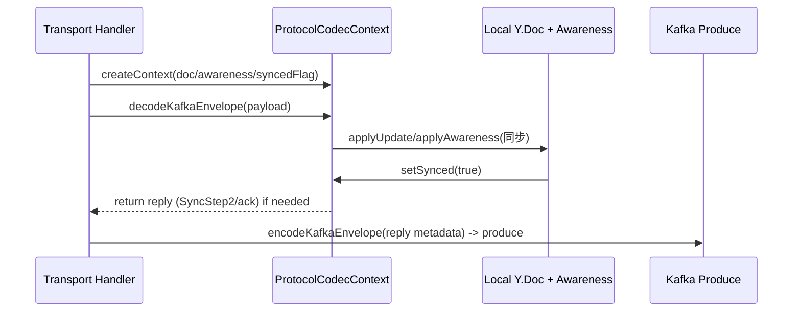
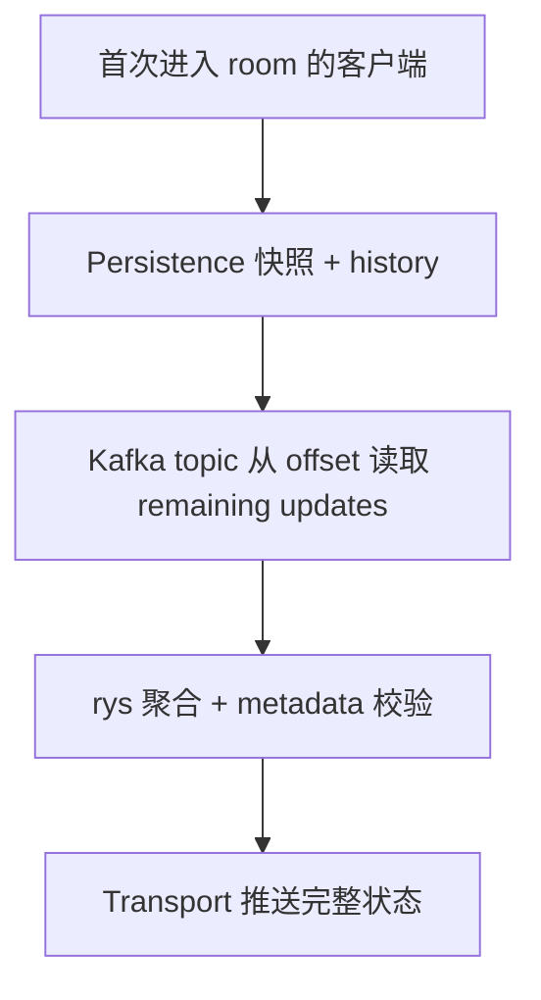

# Kafka 总线驱动的协作架构总纲

## 1. 核心包职责（packages 维度）

| 包 | 主要职责 |
| --- | --- |
| `transport` | 承载 Socket.IO 连接与 Kafka 消息流的桥梁；将客户端发来的 Yjs payload 编码后 `produce` 到 Kafka，同时消费 Kafka topic、解码按 room/subdoc 路由再广播回 socket。房间感知通过 `RoomRegistry` 维护映射，支持按 subdoc 精准广播与自动清理，且在 HTTP 降级场景下复用同一套 registry + 触发 Kafka 轮询。详情参见 @packages/transport/README.md#1-93。 |
| `protocol` | 复刻 y-websocket 协议层，将 `sync`/`awareness`/`control` 等消息封装为 Kafka envelope，实现 metadata（roomId/docId/subdocId/senderId/version）与 payload 的编解码；同时为 `ProtocolCodecContext`、`ProtocolMessageType`、`encodeKafkaEnvelope` 等提供统一 contract，确保 transport 与其他消费者使用一致的 metadata。详情参见 @packages/protocol/README.md#1-247。 |
| `persistence` | 将 Kafka 事件流落盘，提供 `PersistenceCoordinator` 操作：先写 `DocumentSnapshot`（Y.Doc 二进制）再追加 `UpdateHistory`、支持 `recoverSnapshot/exportHistory` 的顺序回放策略，并可在 NestJS 中通过 `PersistenceAdapter`/`Coordinator` 注入。详情参见 @packages/persistence/README.md#1-52。 |

## 2. Kafka + Socket.IO 的协同主线

1. **客户端连接**：本地协同客户端通过 Socket.IO 客户端连接 transport 实例，附带 `roomId`（或 `docId`）/`subdocId`/当前光标/版本等元信息进入 `RoomRegistry`。协同交互的每次 update/awareness 都会携带当前版本号、subdoc 位置，由 handler 补全 `protocol-message` 的 metadata，再送入 Kafka topic（`yjs-doc-{room}`/`yjs-awareness-{room}`） @packages/transport/README.md#20-78。
2. **Kafka 作为唯一总线**：Transport 仅负责 `produce` 与 Kafka consumer；所有实例无状态地订阅相同 topic pattern，由 consumer group 协调 partition，消费后通过 `protocolCodec.decodeKafkaEnvelope` 将 payload 解码，再依据 metadata 找出 `RoomRegistry` 中属于该 room/subdoc 的 sockets 进行广播；若 metadata 中的 `senderId` 与当前 socket 匹配，客户端可避免自回放。@packages/transport/README.md#70-91
3. **版本/metadata 保障**：协议层在`ProtocolMessageMetadata` 中保持 `roomId/docId/subdocId/senderId/version/timestamp`，`roomId` 优先但可回退到 `docId`，以便在 metadata 不齐全时仍能路由。每次交互都更新版本号，后端服务依赖 version 决定 persistence 快照与 update history 的顺序。@packages/protocol/README.md#131-247
4. **Awareness 活动**：Awareness 消息与 doc update 同步通过 Kafka topics 推送，transport 依旧使用 `RoomRegistry` 找到目标 sockets 并 emit `protocol-message`；metadata 与 `awareness update` payload 保持 y-websocket 格式（`action`, `senderId`, `timestamp`），可供客户端恢复 peer 状态。@packages/protocol/README.md#66-130

### 2.1 Kafka Partition 路由与 consumer group 协调

```mermaid
graph TD
    C[Client 输出 metadata] --> T[Transport encodeKafkaEnvelope]
    T --> K[Kafka topic yjs-doc-{room}]
    K --> P1[Partition 0 (consumer group)]
    K --> P2[Partition 1 (consumer group)]
    P1 --> CI1[Transport 实例 A]
    P2 --> CI2[Transport 实例 B]
    CI1 --> R1[RoomRegistry 查找 room/subdoc]
    CI2 --> R2[RoomRegistry 查找 room/subdoc]
    R1 --> S1[连接客户端]
    R2 --> S2[连接客户端]
    click CI1 "#packages/transport/README.md#70-91" "Kafka consumer + RoomRegistry 广播"
```

partition 图展示 metadata 主导的 routing：topic 依据 room/subdoc，consumer group 自动把 partition 分发到不同实例；每个实例再通过 metadata 在 RoomRegistry 精准定位 sockets，避免跨 room 的冗余弹性广播。

### 2.2 ProtocolCodecContext 生命周期与 yjs 处理



这条时序强调 ProtocolCodecContext 如何在 transport 接到 Kafka 消息后，调用 y-websocket 的 `syncProtocol`/`awarenessProtocol` 将变更应用到本地 `Y.Doc`，并在需要时生成 SyncStep2 等回复回 Kafka 以继续全局同步。

## 3. 性能优化与降级策略

1. **聚合下发**：由于多个 socket 可能同时接收 Kafka 消息，transport 在向客户端广播前可进行一次基于 `roomId/subdocId` 的聚合合并（使用 rys 提供的批量计算能力），减少高频 awareness/update 的重复渲染。聚合过程中仍保留 metadata，便于客户端区分版本。
2. **HTTP 降级场景**：当 Socket.IO 降级为 HTTP（Long Poll/SSE）时，客户端切换为将本地最新状态主动发给 transport 服务器，而不是依赖持久的双向连接；服务器在收到请求后从 Kafka topic 的 offset 中拉取当前 room 的所有数据，利用 rys 聚合后再一次性推送给请求方，避免在 HTTP 轮询中频繁重复 fetch。@packages/transport/README.md#76-81

### 3.1 纯 HTTP 模式实现

为支持纯阅读态（Read-only）或 WebSocket 建立失败的场景，系统实现了无状态的 HTTP 接口：

* **状态获取 (`GET /collab/doc/:docId`)**: 混合读取 Persistence 层的最新 `DocumentSnapshot` 和内存中缓存的近期 Kafka `updates`。这允许客户端一次性获得“基线 + 增量”，快速构建最新 Y.Doc 状态，而无需建立长连接。
* **更新提交 (`POST /collab/publish`)**: 允许通过 HTTP POST 直接将 update binary 发送至 Kafka topic。此路径绕过了 Socket.IO 网关，但后续处理（Consumer 消费、Persistence 落盘）完全复用现有链路，保证了数据一致性。

## 3.2 协议 & 消费整改 Checklist

> 勾选以下条目以确保 server 实现重新对齐 README 中的协议与消费约定。建议按顺序推进，避免 envelope/metadata 失配。
>
> 追踪表（可填 `Owner` 与 Issue/PR 链接）：
>
> | Checklist 项 | Owner | Issue / PR | 状态 |
> | --- | --- | --- | --- |
> | HTTP Publish 元数据补齐 & envelope 化 | - | - | ☑ |
> | WebSocket Gateway 保证协议一致 | - | - | ☑ |
> | Kafka 订阅 & topic resolver 抽象 | - | - | ☐ |
> | `GET /collab/doc/:docId` 输出对齐 README | - | - | ☐ |
> | `GET /collab/messages` 调试接口 | - | - | ☐ |
> | 历史写入的强校验 | - | - | ☐ |
> | 文档 & Swagger 更新 | - | - | ☐ |

* [x] **HTTP Publish 元数据补齐 & envelope 化**
  * `PublishUpdateDto` 增加 `version`、`subdocId`、`senderId`、`timestamp`、可选 `metadata`，`channel` 枚举保持 `doc/awareness/control`。
  * `/collab/publish` 接口将 Base64 payload 与上述 metadata 组装为 `ProtocolMessageMetadata`，使用 `encodeKafkaEnvelope` 生成 Kafka 消息；缺失关键字段时直接返回 400。
* [x] **WebSocket Gateway 保证协议一致**
  * `protocol-message` 事件若收到裸 Yjs update，需要结合客户端上传的 metadata 封装后再写 Kafka；能正常解析 envelope 时复用其中 metadata。
  * Gateway 向 Kafka 写入前始终通过 `encodeKafkaEnvelope`，避免 consumer decode 失败。
* [ ] **Kafka 订阅 & topic resolver 抽象**
  * 在 server 层引入 `TopicResolver`，允许根据 `roomId`/`tenantId` 自定义 topic pattern；`ServerCollabService` 与 consumer 订阅均依赖该 resolver。`docTopic` 对应 yjs sync/update 流，`awarenessTopic` 对应 presence，`controlTopic` 预留用于控制指令（如强制快照/权限广播），可按需开启。
  * Consumer 缓存消息时以 `metadata.docId/subdocId` 作为 key，兼容同一 doc 分布在多个 topic 的场景。
* [ ] **`GET /collab/doc/:docId` 输出对齐 README**
  * 响应字段限定为 `{ docId, snapshot, updates }`（updates 已合并 persistence history + Kafka 增量）；若需调试字段，可增加 `_debug` 子对象并在文档中说明。
  * `aggregateKafkaUpdates` 的结果直接合入 `updates`，保证 HTTP 阅读态与 WebSocket 同步体验一致。
* [ ] **`GET /collab/messages` 调试接口**
  * 在 controller 中暴露新路由，返回最近缓存的 envelope Base64（可选 `raw=true` 输出 metadata）；用于排查 metadata/partition。
* [ ] **历史写入的强校验**
  * `recordHistory` 前检查 envelope metadata，缺 `version` 或 `docId` 时记录错误并拒绝入库，防止 `update_history` 空洞。
  * 对 HTTP publish 与 Gateway path 增加日志，标记 metadata 缺失或类型错误的请求。
* [ ] **文档 & Swagger 更新**
  * 更新 `README.md` 与 `apps/server/README.md` 描述新的 HTTP 契约和 TopicResolver 使用方式。
  * Swagger (`DocumentBuilder`) 自动暴露新增字段，示例请求包含完整 metadata，便于后续验证。

## 4. 持续聚合与历史数据服务

1. **定期持久化服务**：Kafka 总线持续输出 doc/awareness payload，定时任务订阅这些 topic，将 `ProtocolMessageMetadata` + update binary 交由 `PersistenceCoordinator` 处理：先写 `document_snapshots`（Y.Doc 快照内含版本号），再附带 `update_history`（日志）。该服务可自定义 `PersistenceAdapter`（SQL/对象存储）确保可重放与审计。@packages/persistence/README.md#3-47
2. **无 GC 历史服务**：另一个订阅服务使用无 GC Y.Doc，在上一次持久化快照与当前最新 snapshot 之间保存完整 history baseline（即两端 snapshot 中间的 ydoc 状态），用于支持复杂的历史回放与操作审计查询。Kafka 订阅确保该服务能及时获取所有 update，而 ydoc 保留完整变更链条以便生成 `state vector`。**注意：awareness 事件不写入 persistence，持久化仅针对 doc update bundle。**
3. **强制同步流程**：当客户端首次进入 room 时，需经由 transport 触发一次“强同步”：
   * 先查 persistence 取 `DocumentSnapshot` + `update_history`（`sinceVersion` 传入 snapshot 版本）
   * 再从 Kafka 读取对应 partition offset 的 update（利用 metadata 确保 room/subdoc）
   * 通过 rys 聚合计算后将整合结果推送给客户端，确保本地 doc、awareness、版本号、subdoc 都对齐。
 该流程既靠 persistence 快照提供基线，也依赖 Kafka 的 total-ordered stream 补齐边界，因此任意实例都能基于 metadata 在 `ProtocolCodecContext` 上恢复一致状态。

### 4.1 Persistence 与 History 服务之间的数据流

```mermaid
flowchart LR
    K[Kafka doc/awareness topic] --> HS1[PersistenceCoordinator]
    HS1 --> DB[(document_snapshots/update_history)]
    K --> HS2[无 GC History Service]
    HS2 --> YB[保存 ydoc baseline (无 GC)]
    DB --> R[回放 / export ]
    YB --> R
    click HS1 "#packages/persistence/README.md#3-47" "持久化服务说明"
```

同时订阅 Kafka 的两个服务都共享 metadata：一个按照 `version` 写 snapshot + update history，另一个用无 GC Y.Doc 记录两端快照之间的 baseline。后续回放请求可从 `document_snapshots` 找出 snapshot，再通过 baseline 计算差异，提供完整历史查询能力。

### 4.2 强同步 + 聚合策略综述



rys 聚合在此处承担“批量处理”角色：无论是从 Kafka 还是 HTTP 降级接入，都会先把 metadata 按 room/subdoc 聚合、计算最新版 version，再交给 transport 广播，确保全链条的一致性。@docs/ARCHITECTURE.md#3

## 5. 终端感知与弹性依据

* 所有业务处理均围绕 Kafka 总线：socket 只负责事件仲裁，所有状态回放、历史查询、降级都可重建。
* 通过 metadata（roomId/docId/subdocId/version）与 `ProtocolCodecContext` 形成单一真相；版本号由客户端交互时动态赋值，服务端利用该字段判断是否需要再次聚合、持久化或通知 persistence 服务。
* 使用 rys 提升聚合与回放性能，无论是在 transport 端的广播还是 HTTP 降级的拉取，都以该聚合层为核心，确保传输与持久化在统一模型下运行。

## 6. 开发者入门与配置清单

为了让开发人员快速搭建起最小协作链路，下列步骤包含配置示例与调试要点，确保 transport/protocol/persistence 各扶持部件都能上线。

### 6.1 环境准备

1. 安装依赖：`pnpm install`
2. Kafka 需求：
   * 准备 `yjs-doc-{room}`、`yjs-awareness-{room}`、可选 `yjs-control-{room}` topic。
   * consumer group 名称可统一设置（例如 `y-kafka-transport`），Kafka broker 地址通过环境变量（如 `KAFKA_BROKER=localhost:9092`）注入 transport/persistence。
3. 数据持久化：
   * `persistence` 依赖 TypeORM + `mysql2`，通过 `DATA_SOURCE_URL` 指定数据库（可选 `postgres`）。
   * 表结构为 `document_snapshots`（快照 + storageLocation）与 `update_history`（metadata + payload）。

### 6.2 运行 & 本地调试

1. 启动 transport：

   ```bash
   pnpm --filter @y-kafka-collabation-server/transport dev
   ```

   启动 transport 时，需要确保 Kafka broker 地址正确，并且 consumer group 名称已配置。

   * 绑定 Socket.IO，并将 `roomRegistry`、`protocolCodec`、`kafkaProducer/Consumer` 传入 `createBusSocketHandlers`。
   * `protocolCodec` 负责 `encodeKafkaEnvelope`/`decodeKafkaEnvelope`，需注入同一 metadata schema。

2. 启动 persistence：

   ```bash
   pnpm --filter @y-kafka-collabation-server/persistence dev
   ```

   * `PersistenceCoordinator` 通过 `DataSource` 进行快照与 update 写入，使 `document_snapshots.version` 与 Kafka metadata 中的 `version` 保持一致。
   * 可在 `persistUpdate` 中监控 `historyOnly` 字段控制是否触发快照。

3. protocol 肯定（或）集成；

   * `protocol` 提供 `ProtocolCodecContext`、`decodeMessage`、`encodeSyncStep1` 等 helper，transport/HTTP handler 在处理 Kafka 消息后要通过 codec 更新本地 `Y.Doc` 与 `Awareness`。
   * 版本/metadata 流程：客户端需确保 metadata 每次 update 包含 `senderId`（可取 `doc.clientID`）、`version`（incremental）、`subdocId`（支持子文档路由）。

### 6.3 Metadata & version 约定

| 名称 | 含义 | 要点 |
| --- | --- | --- |
| `roomId` | 聚合粒度，优先用于 topic 路由 | 若缺失 fallback 到 `docId`，保持 topic pattern `yjs-doc-<roomId>` |
| `docId` | 具体 Y.Doc 标识 | 一 room 可多 doc，consumer 以 doc 唯一性构建本地 state |
| `subdocId` | 子文档分片 | 用于 `RoomRegistry` 中精确查找 sockets、consumer 以 subdoc 为 key |
| `version` | 客户端最新变更版本 | persistence 用于快照顺序、历史服务用作 `sinceVersion` |
| `senderId` | 客户端唯一执行者 | consumer 可以 skip 自己的消息、awareness 通过 sender 区分多实例 |
| `timestamp` | 事件时间 | 可用于 metrics、debug 以及 HTTP 降级的差异校验 |

当 transport 收到客户端消息时，应先 `createMetadata` 并通过 codec 编码进 Kafka envelope，消费端 `decodeKafkaEnvelope` 后得到相同 metadata 以便路由、聚合与 persistence 写入。

### 6.4 典型检查点

1. 客户端连接后未收到同步数据：确认 Kafka topic 有更新、transport/kafka consumer 在运行、`RoomRegistry` 存在 socket。
2. metadata mismatch：查看 transport 生成的 envelope（可在 Kafka 监控/日志打印 metadata），确保 `roomId/docId/subdocId` 一致。
3. persistence restore：运行 `recoverSnapshot` 并传递 `sinceVersion`，观察 `exportHistory` 是否返回 delta；若 history 为空，说明 `update_history` 没有写入 version。
4. HTTP 降级请求：接口需 fetch Kafka offset 中的 chunk（可使用 `kafkajs` consumer `getOffsets`）再 run `rys` 聚合，将 `roomId`/`version` 信息汇总后返回给客户端。

### 6.5 推荐扩展

1. 自定义 `RoomRegistry`，引入 Redis pub/sub 实现跨实例 socket 状态同步；可在 `transport` 中 extend `DefaultRoomRegistry` 并实现 `onRemove` hook。
2. 利用 `topicResolver` 配置不同租户的 topic pattern（例如 `yjs-doc-${tenantId}-${roomId}`）。
3. 补充 `control` channel，用于远程触发 `snapshot`、`validate` 等命令。

## 7. 参考资源

* [y-websocket (Yjs 官方)](https://github.com/yjs/y-websocket)：本架构的 metadata 约定、sync/awareness 处理逻辑以及 ProtocolCodecContext 設計参考。
* [@y/protocols](https://github.com/yjs/y-protocols)：提供 `syncProtocol` 与 `awarenessProtocol`，用于 codec 的消息解析与生成。
* [lib0 encoding](https://github.com/yjs/lib0)：Kafka envelope 的 encode/decode 依赖其 `encoding`/`decoding` 工具。
* [Kafka consumer group design](https://kafka.apache.org/documentation/#consumerconfigs_group.instance.id)：指导 partition 分配与多实例扩展的实践。
* [rys 聚合库](https://github.com/equalsraf/rys)：用于 HTTP 降级、初次同步等场景的批量聚合运算。

## 8. 协同服务器测试要点

### 8.1 测试范围总览

1. **协议与 metadata**：客户端发出的所有 `protocol-message`/HTTP publish 请求都应包含 `roomId/docId/subdocId/version/senderId/timestamp`，服务器应在写入 Kafka 前做完整性校验并拒绝缺失字段。
2. **Kafka 生产与消费链路**：验证 doc/awareness/control topic 是否根据 `TopicResolver` 正确解析，消息是否由不同 consumer group 成员按 partition 均衡分配并成功广播回 `RoomRegistry` 持有的 socket。
3. **持久化与回放**：`UpdateHistory` 与 `DocumentSnapshot` 是否按 version 顺序写入；`GET /collab/doc/:docId` 是否能输出 `{ snapshot, updates }` 并附带最新的 Kafka 聚合增量。
4. **降级链路**：HTTP publish/read-only 模式、sync-request（客户端发送 envelope `note=sync-request`）能否触发服务器侧快照回放。
5. **Demo/Provider 行为**：`apps/demo` 在 Y.Doc 初始化、更新与 awareness 变更时是否正确调用 REST/Kafka gateway，并能在多实例并发下保持同一文档状态一致。

### 8.2 服务器侧验证行为与需要记录的数据

1. **WebSocket Gateway**
   * 行为：`join` 时将 socket 绑定到 `docId`，`protocol-message` 时优先尝试 decode envelope，无法 decode 时结合客户端 metadata 重新打包后调用 `collabService.publishUpdate`。
   * 数据：记录 `socket.id`, `docId`, `roomId`, `channel`, `metadata.version`, Kafka `topic/partition/offset`。若 envelope 解码失败需输出原始 payload 大小与错误堆栈。
2. **ServerCollabService.publishUpdate / Kafka Producer**
   * 行为：基于 channel 解析 topic、调用 `encodeKafkaEnvelope`，并在 producer 成功后缓存最近 N 条消息用于 `/collab/messages`。
   * 数据：`topic`, `partition`, `offset`, `metadata.senderId`, `payload byteLength`，同时监控生产耗时与异常。
3. **Kafka Consumer & RoomRegistry**
   * 行为：消费后按 `metadata.roomId/subdocId` 查找 socket，排除 `senderId === socket.data.senderId` 的自回放。
   * 数据：`roomId`, `subdocId`, 匹配 socket 数量，广播耗时。必要时记录未命中 room 的消息以排查客户端订阅状态。
4. **持久化 (snapshot/history)**
   * 行为：`recordHistory` 写入前验证 `docId` 与递增的 `version`，触发 `persistSnapshot` 时校验 Base64/JSON 格式。
   * 数据：`docId`, `version`, `snapshot byteLength`, `history rows inserted`, 与数据库事务耗时。若 version 逆序需报警。
5. **HTTP 调试接口**
   * 行为：`GET /collab/status` 汇总 `kafkaMessageCount` 与 `latestSnapshot`，`GET /collab/messages` 输出最近 envelope（含 metadata）用于前端对照。
   * 数据：返回结果中 `docId`, `kafkaMessageCount`, `kafkaTail`（topic/partition/offset）应与 Kafka 实际 offset 对齐，可对比 `kafka-consumer-groups` 工具。

### 8.3 客户端侧验证行为与需要采集的数据

1. **Y.Doc 初始化与强同步**
   * 行为：启动时先调用 `GET /collab/doc/:docId`，使用 `Y.applyUpdate`/`Y.decodeStateVector` 合并 snapshot 与 updates，再建立 Socket.IO/HTTP 连接。
   * 数据：记录 `snapshot size`, `updates count`, 应用耗时；若 `stateVector` version 与服务器日志不一致需输出本地 `doc.clientID` 与版本。
2. **ProtocolProvider metadata 填充**
   * 行为：每次 `Y.doc.on('update')` 时生成 `ProtocolMessageMetadata`，`roomId` 默认 `collab-doc`，`docId` 采用 GUID，`version` 递增，`senderId` 使用 `doc.clientID`。
   * 数据：本地缓存最近一次发送与服务器回放的 `version`，若出现跳号需要打印差值与对应 payload 哈希。
3. **Awareness 与 cursor**
   * 行为：`awareness.on('update')` 时发送 `channel='awareness'` 的 payload，并监听服务器广播的同类型消息更新本地 peers。
   * 数据：记录 `awareness.states.size`, `senderId`, `timestamp`；若接收不到自己以外的 peers，需要对比服务器的 RoomRegistry socket 列表与 Kafka 消费日志。
4. **降级/恢复路径**
   * 行为：当 WebSocket 断开或自动降级到 HTTP 时，客户端应切换为轮询 `GET /collab/doc/:docId` 并在本地去重 version；恢复连接后发送 `sync-request` envelope。
   * 数据：降级期间的 `poll interval`, `updates merged`, `sinceVersion`，以及重新连回后服务器响应的 payload 数量，确保没有重复应用。
5. **并发编辑实验**
   * 行为：至少启动两个 demo 客户端对同一 `roomId/docId` 进行交叉编辑，观察 Kafka 广播与 Y.Doc merge 是否一致。
   * 数据：每端统计 `local version`, `remote version`, `latency (send -> receive)`；若发现偏差，配合服务器 `/collab/messages` 输出 envelope 进行对比。

### 8.4 实操验证流程建议

1. **准备环境**：启动 Kafka/MySQL 与 `apps/server`、`apps/demo`，确保 `.env` 中的 `KAFKA_BROKERS`、`COLLAB_SERVER_URL` 配置正确。
2. **单客户端基线**：
   * 步骤：打开一个 demo，创建文档，触发 `Y.doc.update` 与 `awareness` 变更。
   * 预期：`GET /collab/status` 能看到对应 `docId`，Kafka 消息计数递增，`/collab/doc/:docId` 返回 snapshot+updates。
3. **多客户端协同**：
   * 步骤：第二个 demo 通过相同 `docId` 加入，先触发 `sync-request`，再进行交错编辑。
   * 预期：双方 `version` 线性递增、延迟稳定（<200ms），服务器广播日志显示两个 socket 都收到消息。
4. **降级/恢复**：
   * 步骤：断开其中一端的 WebSocket（如关闭网络或模拟 503），观察客户端是否切换 HTTP 模式并继续收/发更新；恢复后发送 `sync-request`。
   * 预期：降级期间不会丢 update，恢复后只需重播缺口；服务器日志显示来自 HTTP publish 的消息成功落入 Kafka。
5. **持久化回放**：
   * 步骤：调用 `POST /collab/persist` 生成 snapshot，清空客户端状态后仅靠 `GET /collab/doc/:docId` + Kafka 广播恢复。
   * 预期：回放后文档状态与持久化前一致，`update_history` 表存在相应 version 记录。

通过上述步骤可系统化排查 demo 端“无法协同”的根因：若 metadata 缺失，可以在服务器日志中迅速定位；若 Kafka 广播缺席，则检查 TopicResolver 与 consumer group；若客户端未按 version 应用，则通过本地统计与服务器 `/collab/messages` 对比定位到具体 payload。
