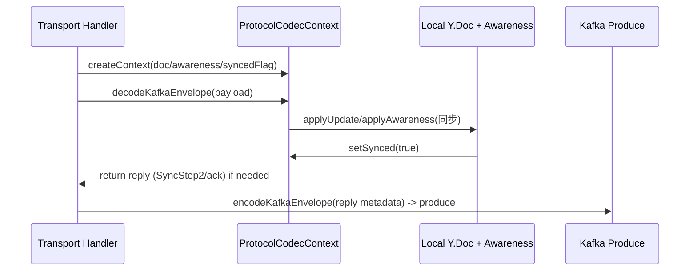
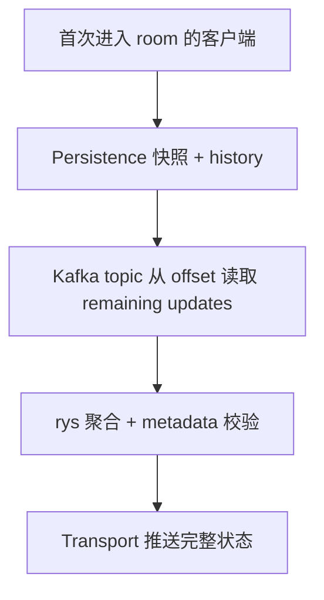

# Kafka 总线驱动的协作架构总纲

## 1. 核心包职责（packages 维度）

| 包 | 主要职责 |
| --- | --- |
| `transport` | 承载 Socket.IO 连接与 Kafka 消息流的桥梁；将客户端发来的 Yjs payload 编码后 `produce` 到 Kafka，同时消费 Kafka topic、解码按 room/subdoc 路由再广播回 socket。房间感知通过 `RoomRegistry` 维护映射，支持按 subdoc 精准广播与自动清理，且在 HTTP 降级场景下复用同一套 registry + 触发 Kafka 轮询。详情参见 @packages/transport/README.md#1-93。 |
| `protocol` | 复刻 y-websocket 协议层，将 `sync`/`awareness`/`control` 等消息封装为 Kafka envelope，实现 metadata（roomId/docId/subdocId/senderId/version）与 payload 的编解码；同时为 `ProtocolCodecContext`、`ProtocolMessageType`、`encodeKafkaEnvelope` 等提供统一 contract，确保 transport 与其他消费者使用一致的 metadata。详情参见 @packages/protocol/README.md#1-247。 |
| `persistence` | 将 Kafka 事件流落盘，提供 `PersistenceCoordinator` 操作：先写 `DocumentSnapshot`（Y.Doc 二进制）再追加 `UpdateHistory`、支持 `recoverSnapshot/exportHistory` 的顺序回放策略，并可在 NestJS 中通过 `PersistenceAdapter`/`Coordinator` 注入。详情参见 @packages/persistence/README.md#1-52。 |

## 2. Kafka + Socket.IO 的协同主线

1. **客户端连接**：本地协同客户端通过 Socket.IO 客户端连接 transport 实例，附带 `roomId`（或 `docId`）/`subdocId`/当前光标/版本等元信息进入 `RoomRegistry`。协同交互的每次 update/awareness 都会携带当前版本号、subdoc 位置，由 handler 补全 `protocol-message` 的 metadata，再送入 Kafka topic（`yjs-doc-{room}`/`yjs-awareness-{room}`） @packages/transport/README.md#20-78。
2. **Kafka 作为唯一总线**：Transport 仅负责 `produce` 与 Kafka consumer；所有实例无状态地订阅相同 topic pattern，由 consumer group 协调 partition，消费后通过 `protocolCodec.decodeKafkaEnvelope` 将 payload 解码，再依据 metadata 找出 `RoomRegistry` 中属于该 room/subdoc 的 sockets 进行广播；若 metadata 中的 `senderId` 与当前 socket 匹配，客户端可避免自回放。@packages/transport/README.md#70-91
3. **版本/metadata 保障**：协议层在`ProtocolMessageMetadata` 中保持 `roomId/docId/subdocId/senderId/version/timestamp`，`roomId` 优先但可回退到 `docId`，以便在 metadata 不齐全时仍能路由。每次交互都更新版本号，后端服务依赖 version 决定 persistence 快照与 update history 的顺序。@packages/protocol/README.md#131-247
4. **Awareness 活动**：Awareness 消息与 doc update 同步通过 Kafka topics 推送，transport 依旧使用 `RoomRegistry` 找到目标 sockets 并 emit `protocol-message`；metadata 与 `awareness update` payload 保持 y-websocket 格式（`action`, `senderId`, `timestamp`），可供客户端恢复 peer 状态。@packages/protocol/README.md#66-130

### 2.1 Kafka Partition 路由与 consumer group 协调

```mermaid
graph TD
    C[Client 输出 metadata] --> T[Transport encodeKafkaEnvelope]
    T --> K[Kafka topic yjs-doc-{room}]
    K --> P1[Partition 0 (consumer group)]
    K --> P2[Partition 1 (consumer group)]
    P1 --> CI1[Transport 实例 A]
    P2 --> CI2[Transport 实例 B]
    CI1 --> R1[RoomRegistry 查找 room/subdoc]
    CI2 --> R2[RoomRegistry 查找 room/subdoc]
    R1 --> S1[连接客户端]
    R2 --> S2[连接客户端]
    click CI1 "#packages/transport/README.md#70-91" "Kafka consumer + RoomRegistry 广播"
```

partition 图展示 metadata 主导的 routing：topic 依据 room/subdoc，consumer group 自动把 partition 分发到不同实例；每个实例再通过 metadata 在 RoomRegistry 精准定位 sockets，避免跨 room 的冗余弹性广播。

### 2.2 ProtocolCodecContext 生命周期与 yjs 处理



这条时序强调 ProtocolCodecContext 如何在 transport 接到 Kafka 消息后，调用 y-websocket 的 `syncProtocol`/`awarenessProtocol` 将变更应用到本地 `Y.Doc`，并在需要时生成 SyncStep2 等回复回 Kafka 以继续全局同步。

## 3. 性能优化与降级策略

1. **聚合下发**：由于多个 socket 可能同时接收 Kafka 消息，transport 在向客户端广播前可进行一次基于 `roomId/subdocId` 的聚合合并（使用 rys 提供的批量计算能力），减少高频 awareness/update 的重复渲染。聚合过程中仍保留 metadata，便于客户端区分版本。
2. **HTTP 降级场景**：当 Socket.IO 降级为 HTTP（Long Poll/SSE）时，客户端切换为将本地最新状态主动发给 transport 服务器，而不是依赖持久的双向连接；服务器在收到请求后从 Kafka topic 的 offset 中拉取当前 room 的所有数据，利用 rys 聚合后再一次性推送给请求方，避免在 HTTP 轮询中频繁重复 fetch。@packages/transport/README.md#76-81

### 3.1 纯 HTTP 模式实现

为支持纯阅读态（Read-only）或 WebSocket 建立失败的场景，系统实现了无状态的 HTTP 接口：

* **状态获取 (`GET /collab/doc/:docId`)**: 混合读取 Persistence 层的最新 `DocumentSnapshot` 和内存中缓存的近期 Kafka `updates`。这允许客户端一次性获得“基线 + 增量”，快速构建最新 Y.Doc 状态，而无需建立长连接。
* **更新提交 (`POST /collab/publish`)**: 允许通过 HTTP POST 直接将 update binary 发送至 Kafka topic。此路径绕过了 Socket.IO 网关，但后续处理（Consumer 消费、Persistence 落盘）完全复用现有链路，保证了数据一致性。

## 4. 持续聚合与历史数据服务

1. **定期持久化服务**：Kafka 总线持续输出 doc/awareness payload，定时任务订阅这些 topic，将 `ProtocolMessageMetadata` + update binary 交由 `PersistenceCoordinator` 处理：先写 `document_snapshots`（Y.Doc 快照内含版本号），再附带 `update_history`（日志）。该服务可自定义 `PersistenceAdapter`（SQL/对象存储）确保可重放与审计。@packages/persistence/README.md#3-47
2. **无 GC 历史服务**：另一个订阅服务使用无 GC Y.Doc，在上一次持久化快照与当前最新 snapshot 之间保存完整 history baseline（即两端 snapshot 中间的 ydoc 状态），用于支持复杂的历史回放与操作审计查询。Kafka 订阅确保该服务能及时获取所有 update，而 ydoc 保留完整变更链条以便生成 `state vector`。**注意：awareness 事件不写入 persistence，持久化仅针对 doc update bundle。**
3. **强制同步流程**：当客户端首次进入 room 时，需经由 transport 触发一次“强同步”：
   * 先查 persistence 取 `DocumentSnapshot` + `update_history`（`sinceVersion` 传入 snapshot 版本）
   * 再从 Kafka 读取对应 partition offset 的 update（利用 metadata 确保 room/subdoc）
   * 通过 rys 聚合计算后将整合结果推送给客户端，确保本地 doc、awareness、版本号、subdoc 都对齐。
 该流程既靠 persistence 快照提供基线，也依赖 Kafka 的 total-ordered stream 补齐边界，因此任意实例都能基于 metadata 在 `ProtocolCodecContext` 上恢复一致状态。

### 4.1 Persistence 与 History 服务之间的数据流

```mermaid
flowchart LR
    K[Kafka doc/awareness topic] --> HS1[PersistenceCoordinator]
    HS1 --> DB[(document_snapshots/update_history)]
    K --> HS2[无 GC History Service]
    HS2 --> YB[保存 ydoc baseline (无 GC)]
    DB --> R[回放 / export ]
    YB --> R
    click HS1 "#packages/persistence/README.md#3-47" "持久化服务说明"
```

同时订阅 Kafka 的两个服务都共享 metadata：一个按照 `version` 写 snapshot + update history，另一个用无 GC Y.Doc 记录两端快照之间的 baseline。后续回放请求可从 `document_snapshots` 找出 snapshot，再通过 baseline 计算差异，提供完整历史查询能力。

### 4.2 强同步 + 聚合策略综述



rys 聚合在此处承担“批量处理”角色：无论是从 Kafka 还是 HTTP 降级接入，都会先把 metadata 按 room/subdoc 聚合、计算最新版 version，再交给 transport 广播，确保全链条的一致性。@docs/ARCHITECTURE.md#3

## 5. 终端感知与弹性依据

* 所有业务处理均围绕 Kafka 总线：socket 只负责事件仲裁，所有状态回放、历史查询、降级都可重建。
* 通过 metadata（roomId/docId/subdocId/version）与 `ProtocolCodecContext` 形成单一真相；版本号由客户端交互时动态赋值，服务端利用该字段判断是否需要再次聚合、持久化或通知 persistence 服务。
* 使用 rys 提升聚合与回放性能，无论是在 transport 端的广播还是 HTTP 降级的拉取，都以该聚合层为核心，确保传输与持久化在统一模型下运行。

## 6. 开发者入门与配置清单

为了让开发人员快速搭建起最小协作链路，下列步骤包含配置示例与调试要点，确保 transport/protocol/persistence 各扶持部件都能上线。

### 6.1 环境准备

1. 安装依赖：`pnpm install`
2. Kafka 需求：
   * 准备 `yjs-doc-{room}`、`yjs-awareness-{room}`、可选 `yjs-control-{room}` topic。
   * consumer group 名称可统一设置（例如 `y-kafka-transport`），Kafka broker 地址通过环境变量（如 `KAFKA_BROKER=localhost:9092`）注入 transport/persistence。
3. 数据持久化：
   * `persistence` 依赖 TypeORM + `mysql2`，通过 `DATA_SOURCE_URL` 指定数据库（可选 `postgres`）。
   * 表结构为 `document_snapshots`（快照 + storageLocation）与 `update_history`（metadata + payload）。

### 6.2 运行 & 本地调试

1. 启动 transport：

   ```bash
   pnpm --filter @y-kafka-collabation-server/transport dev
   ```

   启动 transport 时，需要确保 Kafka broker 地址正确，并且 consumer group 名称已配置。

   * 绑定 Socket.IO，并将 `roomRegistry`、`protocolCodec`、`kafkaProducer/Consumer` 传入 `createBusSocketHandlers`。
   * `protocolCodec` 负责 `encodeKafkaEnvelope`/`decodeKafkaEnvelope`，需注入同一 metadata schema。

2. 启动 persistence：

   ```bash
   pnpm --filter @y-kafka-collabation-server/persistence dev
   ```

   * `PersistenceCoordinator` 通过 `DataSource` 进行快照与 update 写入，使 `document_snapshots.version` 与 Kafka metadata 中的 `version` 保持一致。
   * 可在 `persistUpdate` 中监控 `historyOnly` 字段控制是否触发快照。

3. protocol 肯定（或）集成；

   * `protocol` 提供 `ProtocolCodecContext`、`decodeMessage`、`encodeSyncStep1` 等 helper，transport/HTTP handler 在处理 Kafka 消息后要通过 codec 更新本地 `Y.Doc` 与 `Awareness`。
   * 版本/metadata 流程：客户端需确保 metadata 每次 update 包含 `senderId`（可取 `doc.clientID`）、`version`（incremental）、`subdocId`（支持子文档路由）。

### 6.3 Metadata & version 约定

| 名称 | 含义 | 要点 |
| --- | --- | --- |
| `roomId` | 聚合粒度，优先用于 topic 路由 | 若缺失 fallback 到 `docId`，保持 topic pattern `yjs-doc-<roomId>` |
| `docId` | 具体 Y.Doc 标识 | 一 room 可多 doc，consumer 以 doc 唯一性构建本地 state |
| `subdocId` | 子文档分片 | 用于 `RoomRegistry` 中精确查找 sockets、consumer 以 subdoc 为 key |
| `version` | 客户端最新变更版本 | persistence 用于快照顺序、历史服务用作 `sinceVersion` |
| `senderId` | 客户端唯一执行者 | consumer 可以 skip 自己的消息、awareness 通过 sender 区分多实例 |
| `timestamp` | 事件时间 | 可用于 metrics、debug 以及 HTTP 降级的差异校验 |

当 transport 收到客户端消息时，应先 `createMetadata` 并通过 codec 编码进 Kafka envelope，消费端 `decodeKafkaEnvelope` 后得到相同 metadata 以便路由、聚合与 persistence 写入。

### 6.4 典型检查点

1. 客户端连接后未收到同步数据：确认 Kafka topic 有更新、transport/kafka consumer 在运行、`RoomRegistry` 存在 socket。
2. metadata mismatch：查看 transport 生成的 envelope（可在 Kafka 监控/日志打印 metadata），确保 `roomId/docId/subdocId` 一致。
3. persistence restore：运行 `recoverSnapshot` 并传递 `sinceVersion`，观察 `exportHistory` 是否返回 delta；若 history 为空，说明 `update_history` 没有写入 version。
4. HTTP 降级请求：接口需 fetch Kafka offset 中的 chunk（可使用 `kafkajs` consumer `getOffsets`）再 run `rys` 聚合，将 `roomId`/`version` 信息汇总后返回给客户端。

### 6.5 推荐扩展

1. 自定义 `RoomRegistry`，引入 Redis pub/sub 实现跨实例 socket 状态同步；可在 `transport` 中 extend `DefaultRoomRegistry` 并实现 `onRemove` hook。
2. 利用 `topicResolver` 配置不同租户的 topic pattern（例如 `yjs-doc-${tenantId}-${roomId}`）。
3. 补充 `control` channel，用于远程触发 `snapshot`、`validate` 等命令。

## 7. 参考资源

* [y-websocket (Yjs 官方)](https://github.com/yjs/y-websocket)：本架构的 metadata 约定、sync/awareness 处理逻辑以及 ProtocolCodecContext 設計参考。
* [@y/protocols](https://github.com/yjs/y-protocols)：提供 `syncProtocol` 与 `awarenessProtocol`，用于 codec 的消息解析与生成。
* [lib0 encoding](https://github.com/yjs/lib0)：Kafka envelope 的 encode/decode 依赖其 `encoding`/`decoding` 工具。
* [Kafka consumer group design](https://kafka.apache.org/documentation/#consumerconfigs_group.instance.id)：指导 partition 分配与多实例扩展的实践。
* [rys 聚合库](https://github.com/equalsraf/rys)：用于 HTTP 降级、初次同步等场景的批量聚合运算。

## 8. 开发计划（按重点与难易拆分）

|状态|级别|难度|目标|说明 / 交付物|
|---|---|---|---|---|
|[ ]|**P0：核心对齐**|困难|将 Nest `ServerCollabGateway` 替换为 `packages/transport` 的 RoomRegistry + Kafka handler，真正实现“Socket.IO ⇄ Kafka ⇄ Socket.IO”链路|需要把当前 `Map<docId, sockets>` 改为 `RoomRegistry`，强制客户端 metadata（room/doc/subdoc/sender/version），并依赖 `protocolCodec` 进行 encode/decode；完成后 server 仅作为 transport 实例运行。|
|[x]|**P0：核心对齐**|中等|在 gateway/HTTP 接口中强制 metadata 校验与回传，广播给客户端时包含 `metadata`，以便 senderId/version 去重|Update `ServerCollabService` listener & HTTP 回放逻辑，确保 `protocol-message` payload 附带 Kafka metadata（room/doc/subdoc/version/sender/timestamp）。|
|[x]|**P1：可靠路由与持久化**|中等|拆分 doc/awareness/control topic，接入 `topicResolver`，默认 pattern `yjs-doc-{room}`/`yjs-awareness-{room}`|`publishUpdate` 需根据 channel/metadata 选择 topic，consumer 端按 pattern 订阅并保留 metadata。|
|[ ]|**P1：可靠路由与持久化**|中等|Persistence/history 使用 metadata.version，而非本地 Snowflake，补齐“snapshot → history sinceVersion → Kafka offset”链路|更新 `recordHistory` 与 snapshot 逻辑，确保 version 与 metadata 同步；新增 Kafka offset 聚合步骤（可先存最近 offset 缓存）。|
|[ ]|**P2：降级与体验**|简单|HTTP 请求路径（`/collab/doc`, `/collab/publish`）补上 Kafka offset 拉取 + rys 聚合示例，确保文档与实现一致|在 controller 中调用新聚合服务，demo 里提供“阅读态拉取 + 降级写”流程文档。|
|[ ]|**P2：降级与体验**|简单|在 README/docs 中补充调试指引（如何验证 metadata、topic、RoomRegistry 状态）|输出 checklist + 日志示例，降低排障门槛。|

> 推进建议：先完成 **P0/P1**，因为 transport & metadata 才能支撑其余能力；P2 可在主链路稳定后补齐。
